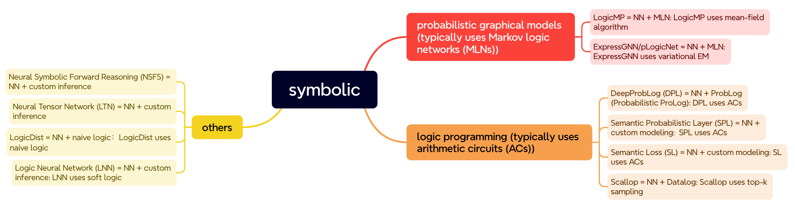

Fig. 1: Framework of popular neuro-symbolic methods.

Neuro-symbolic (nesy) reasoning is a branch of symbolic reasoning. Due to its significant importance, we discuss it as a separate topic. Generally, when we talk about representation learning, we are referring to neural networks. Neural networks encapsulate complex processes within nonlinear procedures, possessing strong expressive capabilities. However, neural networks struggle with explicit logical reasoning tasks, such as mathematical computation and program logic reasoning problems. Although neural networks can attain a certain level of reasoning ability after extensive data training, this ability is built on a large dataset, and the patterns learned may not always be reliable. Therefore, a considerable number of researchers have begun studying neural-symbolic reasoning methods.

There are large amount of Nesy methods. We group these methods from the aspect of their roots. Briefly, the nesy methods have two main sources. As shown in Fig. 1, the first group roots from the probabilistic graphical model (PGM), combining symbolic logic. The second group stems in conventional logic programming (LP), combining the specific probabilistic modeling. Besides, some other methods proposes their own nesy formalizations. 

## PGM-based Methods

The first group of methods is based on the PGMs. Specifically, these methods are based on the combination of PGMs and logic, e.g., the Markov logic network (MLN). Several modern nesy methods combine MLN with NNs:

1. LogicMP: LogicMP is principally an efficient MLN inference. Since the inference can be implemented using parallel tensor compuation. It can be regarded as a special NN layer.
2. ExpressGNN/pLogicNet: Both methods are based on MLN as well. However, they adopted variational EM for MLN inference where NN and MLN remain seperate.

## LP-based methods

The second group is based on the LP. Specifically, these methods are based on the combination of conventional logic programming with uncertainty, i.e., probabilistic logic programming (PLP), which typically uses arithmetic curcuits (ACs) for knowledge compilation. Several modern nesy methods combine PLP with NNs:

1. DeepProbLog: DeepProbLog uses a neural backbone to generate the input of ProbLog, which is the probabilistic version of Prolog. The inference is solved by ACs.
2. Semantic Probabilistic Layer（SPL): SPL customizes a proababilistic modeling with logic, using ACs. 
3. Semantic Loss (SL): Similar to SPL, SL customizes a loss with logic which can be calculated by ACs.
4. Scallop: It is based on the Datalog which is a subset of Prolog. Scallop samples several groundings in the training and inference, instead of deriving all the grounding paths.

## Other methods
1. neuro-symbolic forward reasoning (NSFS): NSFS proposes a customized message passing method for inference and training. 
2. Logic Tensor Network (LTN): LTN proposes a customzied message aggregation method for inference and training.
3. Logical Neural Networks (LNN): LNN proposes a customized way to manipulate on the soft logic.
4. LogicDist: It uses a posterior regularization method to incorporate the logical constraints.

# Conclusion
Among the massive nesy methods, we introduced the most important ones in the literature. They are MLN-based methods (ExpressGNN/pLogicNet/LogicMP) and LP-based methods (DeepProbLog/SPL/SL/Scallop). Other important methods include NSFS/LTN/LNN/LogicDist. 
